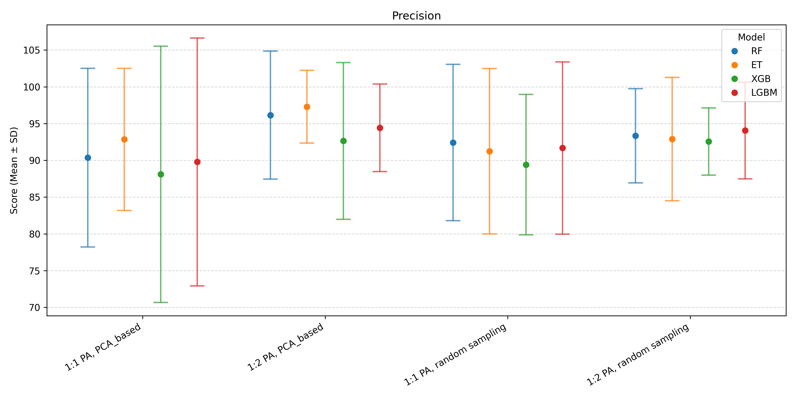

# Machine Learning Workshop Project 

Pre-workshop for EEID (Ecology and Evolution of Infectious Diseases) 2025. Code expanded from workshop, presented by Pranav Pandit and Pranav Kulkarni from UC Davis.

## Species Distribution Modeling (SDM) — Workshop Assignment

This project extends workshop example code to train **ensemble SDMs**, compare **presence–absence (PA)** sampling strategies, and visualize current vs. **SSP2** future distributions. It evaluates four tree-based methods (RF, ET, XGB, LGBM), ensembles predictions by mean, exports rasters, produces **difference maps**, and inspects **feature importance** and **partial dependence**.

---

We use **GeoTIFF** (`.tif`) rasters, which include spatial metadata (projection, resolution, origin) so every pixel lines up correctly on a map.

In this project:

- **Shapefile** = PA points with a presence (=1) or absence (=0) label.  
- **Raster** = environmental layers (predictors) covering the entire study region.

**Modeling flow:** we extract raster values under each PA point to form the tabular features used by the ML models. For prediction, we run the trained model on **every pixel** in the raster grid to produce a new raster where each cell is the **predicted probability of presence**.

---

## Presence–Absence (PA) design & sampling strategies

### The two absence strategies we compare

1) **Random background (geographic random)**  
   - **What:** sample pseudo-absence points uniformly at random across the study area..  
   - **Why:** simple baseline; reflects geographical availability of conditions.  
   - **Trade-offs:** may place absences in environmental conditions similar to presences (harder classification); can reflect spatial sampling bias.

2) **PCA-based background (environmental stratification)**  
   - **What:** run PCA on environmental rasters; sample pseudo-absences to **cover environmental space** more evenly (not just geographic space).  
   - **Why:** reduces over-representation of common conditions, improves class separation and stability; less sensitive to uneven geography.  
   - **Trade-offs:** more preprocessing; relies on PCA of covariates.

In this repo there are **four PA recipes** (two strategies × two class ratios):

- `..._pca_ratio_1_0.shp`  → PCA-based, **1:1** (presences : absences)  
- `..._pca_ratio_2_0.shp`  → PCA-based, **1:2**  
- `..._random_ratio_1_0.shp` → Random, **1:1**  
- `..._random_ratio_2_0.shp` → Random, **1:2**

### Class ratios: 1:1 vs 1:2
- **1:1** keeps classes balanced; often easier optimization and cleaner calibration near 0.5.
- **1:2** (more absences) mimics rarer species reality; can **improve recall** but may reduce precision; affects threshold-dependent metrics.

We **stratify** the train/test split to preserve the chosen class ratio within each run.

---

## Pipeline (step-by-step)

1. **Load inputs**
   - Pick one PA shapefile for the species.  
   - Load **current** environmental rasters.  
   - Load **future (SSP2)** environmental rasters.

2. **Preprocess**
   - **Stratified** train/test split on the response field (presence/absence).  
   - **Extract raster values** at PA point locations → feature matrix.  
   - **Handle missing values:** impute `NaN` in features by column mean; set `NaN` in full-map target stacks to **0** to ensure model can run everywhere.

3. **Train models (no feature selection)**
   - Train **RandomForest (RF)**, **ExtraTrees (ET)**, **XGBoost (XGB)**, **LightGBM (LGBM)**.  
   - **5-fold cross-validation**: report **Accuracy, ROC-AUC, Precision, Recall** as **mean ± 2×SD**.

4. **Predict & export**
   - For each model, create **probability** and **certainty** rasters for **current** and **SSP2** conditions.  
   - Build **ensemble raster** = pixel-wise mean of RF/ET/XGB/LGBM probabilities.

5. **Analyze**
   - **Summary tables** (Recall/Precision ± SD) across the 4 PA recipes and 4 models.  
   - **Dot-whisker plots** to compare means with error bars by recipe/model.  
   - **Difference maps** = (**SSP2 − current**) probability (red = increased suitability; blue = decreased).  
   - **Feature importance** (tree-based `feature_importances_`) to see which variables drive predictions.  
   - **Partial Dependence Plots (PDPs)** for **top-3 features** per model/run (average effect curves).

6. **Repeat** for all **four** PA recipes, then compare outcomes to understand how PA strategy and ratio influence performance and maps.

---

## Results
 
Model results with the species: Miniopterus schreibersii
| | | | |
|:-:|:-:|:-:|:-:|
|  |
|  |
|  |
|  |

| | |
|:-:|:-:|
|  |  | 

